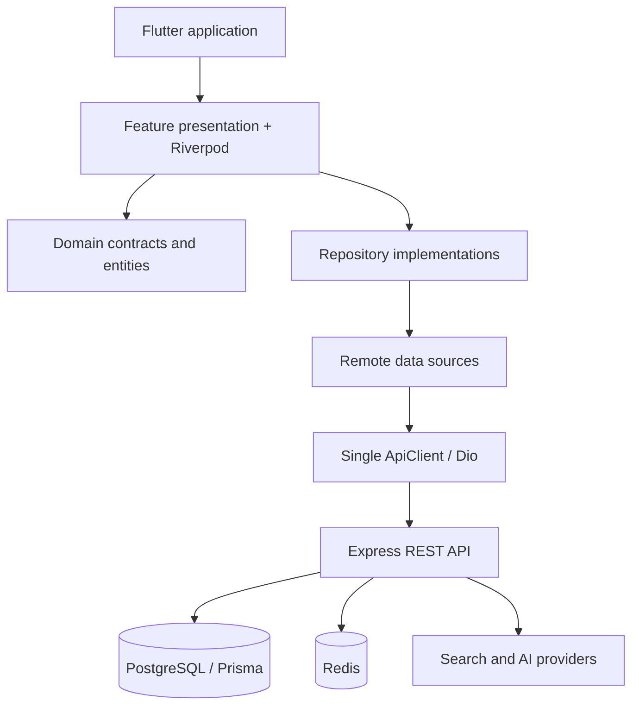

# Dealio — production-oriented Flutter case study

Dealio is an AI-powered shopping assistant. The project demonstrates how a real Flutter application can combine authentication, progressive search, store comparison, AI analysis, barcode/image recognition, alerts, subscriptions, localization, and secure persistence.

## Engineering highlights

- Feature-first Flutter structure with presentation, domain, and data boundaries.
- Riverpod state management and GoRouter navigation.
- A single configured Dio/ApiClient instance with token refresh handling.
- Secure access and refresh token storage.
- Search remote datasource separated from repository response mapping.
- Progressive search with polling, cancellation, quota handling, and error states.
- Backend powered by TypeScript, Express, Prisma, PostgreSQL, Redis, and workers.
- Unit, widget, integration-style polling, and backend service tests.
- Environment-based API configuration with HTTPS enforcement for release builds.

## Architecture



## Backend integration

The Flutter app expects the backend at `/api` and uses these primary flows:

| Flow | Endpoint |
| --- | --- |
| Login | `POST /api/auth/login` |
| Register | `POST /api/auth/register` |
| Refresh | `POST /api/auth/refresh` |
| Search | `POST /api/search` |
| Search status | `GET /api/search/status/:requestId` |
| Countries/stores | `GET /api/search/countries`, `GET /api/search/stores` |
| AI agent search | `POST /api/ai/agent-search` |
| Billing status | `GET /api/billing/me` |

Run the Flutter project against a local backend with:

```bash
flutter run --dart-define=API_BASE_URL=http://localhost:3000
```

## Verification

The integrated project was checked with `dart analyze` and `flutter test`. The backend was checked with TypeScript type-checking and its automated test suite. The local backend health endpoint returned `200 OK`, with Prisma and Redis initialized successfully.

## Portfolio value

This project is included as a complete case study rather than a collection of isolated snippets. It shows product-level decisions, API contracts, security boundaries, performance considerations, failure handling, and the trade-offs required to move a Flutter app from demo behavior toward production readiness.

## Visual demo

Screenshots and the product walkthrough are maintained separately from source code:

- [Dealio screenshots](../../assets/screenshots/dealio/README.md)
- [Dealio demo video](../../assets/videos/dealio/README.md)

Recommended screenshot filenames:

```text
assets/screenshots/dealio/
├── 01-login.png
├── 02-search.png
├── 03-progressive-results.png
├── 04-product-detail.png
├── 05-store-comparison.png
└── 06-profile-alerts.png
```

After adding the real images, feature them in the portfolio by linking them from
this case study and from the root `README.md`. Keep screenshots free of tokens,
personal data, and unfinished debug UI.
