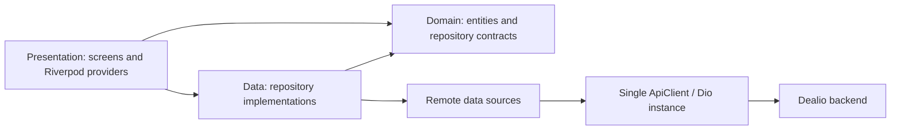

# Dealio architecture



## Rules

- Presentation code must not own HTTP calls.
- Data sources own transport and endpoint calls.
- Repositories map responses into domain-facing models.
- The app uses one `ApiClient` and one interceptor/refresh pipeline.
- `API_BASE_URL` is supplied with `--dart-define`; release builds require HTTPS.
- Demo fixtures are isolated and are never selected by production flags.

## Run against a backend

```bash
flutter run --dart-define=API_BASE_URL=https://api.example.com
```
